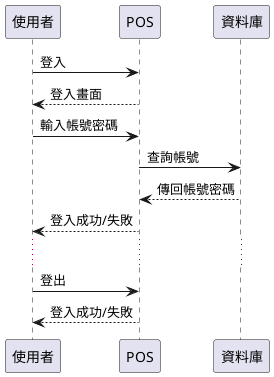
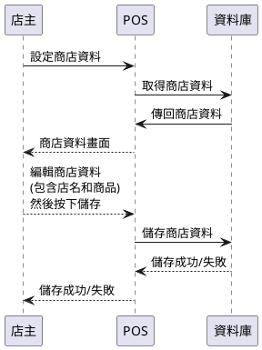
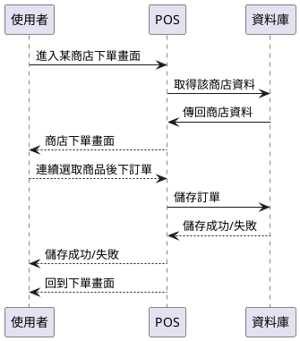
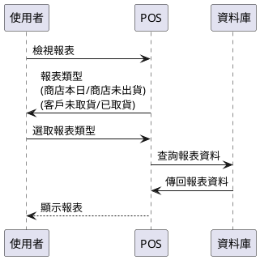

# 循序圖

## 登入/登出 

使用者: 店主 + 客戶

```puml
@startuml
使用者 -> POS: 登入
POS --> 使用者: 登入畫面
使用者 -> POS: 輸入帳號密碼
POS -> 資料庫: 查詢帳號
資料庫 --> POS : 傳回帳號密碼
POS --> 使用者: 登入成功/失敗
...
使用者 -> POS: 登出
POS --> 使用者: 登入成功/失敗
@enduml
```

## 設定商店資料

使用者 : 店主

```puml
@startuml
店主 -> POS: 設定商店資料
POS -> 資料庫: 取得商店資料
資料庫 -> POS : 傳回商店資料
POS --> 店主: 商店資料畫面
店主 --> POS: 編輯商店資料\n(包含店名和商品)\n然後按下儲存
POS -> 資料庫: 儲存商店資料
資料庫 --> POS : 儲存成功/失敗
POS --> 店主: 儲存成功/失敗
@enduml
```

## 下單

使用者 : 店主 + 客戶

```puml
@startuml
使用者 -> POS: 進入某商店下單畫面
POS -> 資料庫: 取得該商店資料
資料庫 -> POS : 傳回商店資料
POS --> 使用者: 商店下單畫面
使用者 --> POS: 連續選取商品後下訂單
POS -> 資料庫: 儲存訂單
資料庫 --> POS : 儲存成功/失敗
POS --> 使用者: 儲存成功/失敗
POS --> 使用者: 回到下單畫面
@enduml
```

## 商店報表

使用者 : 店主 + 客戶

```puml
@startuml
使用者 -> POS: 檢視報表
POS -> 使用者: 報表類型\n(商店本日/商店未出貨)\n(客戶未取貨/已取貨)
使用者 -> POS: 選取報表類型
POS -> 資料庫: 查詢報表資料
資料庫 -> POS : 傳回報表資料
POS --> 使用者: 顯示報表
@enduml
```

