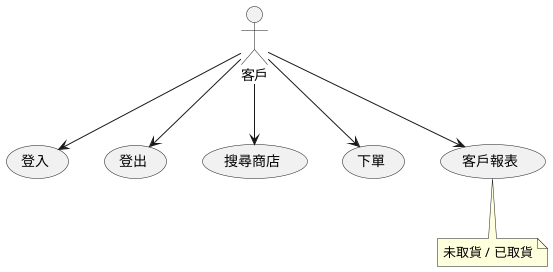
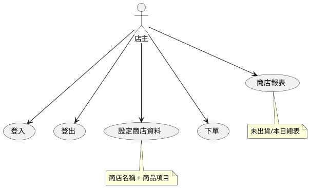

# iPos 系統

## PlantUML

學習 PlantUML 並安裝 VsCode 的插件

* http://plantuml.com/

Markdown Preview Enhanced 對 Markdown 按 Ctrl-K-V 可以預覽

PlantUML 的副檔名必須要是 puml 才能正確顯示。(預覽用 Alt-D)

## 需求分析

1. 註冊/登入/登出
2. 設定商店資料: 商店名稱與產品項目
3. 下單: 可能由使用者或商店主輸入
4. 出貨確認: 商店主與使用者雙方之一確認即可
5. 商店報表: (當日/歷史/未出貨)
6. 客戶報表: (未取貨/下單紀錄)

## 使用個案 -- 客戶

## 使用個案 - 店主

